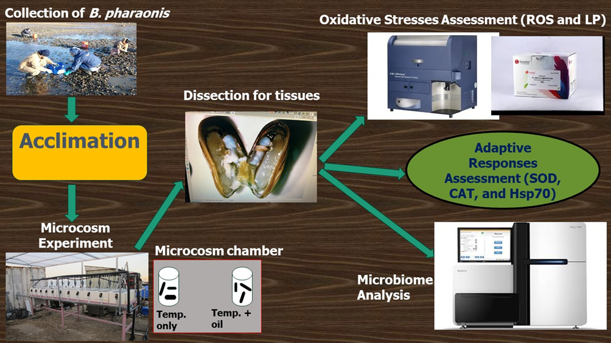

# **Protocols for Assessing Lipid Peroxidation and Microbiome DNA Analysis in *Brachidontes pharaonis***

### **Lipid Peroxidation via Malondialdehyde (MDA) Content**

1. Collect and homogenize tissues of *B. pharaonis* in pre-cold 100 mM Potassium Buffered Saline (PBS) at a ratio of 1:9 (m/v) using a handheld homogenizer.
2. Centrifuge the tissue homogenates at 500x g for 20 minutes at 4°C.
3. In a 5 ml tube, add 200 µl of the homogenate, 200 µl of Radio-Immunoprecipitation Assay (RIPA) buffer, 3 ml of phosphotungstic acid solution, and 200 µl of thiobarbituric acid (TBA), then mix thoroughly.
4. Incubate the mixture at 95°C for 40 minutes.
5. Cool the mixture in an ice bath.
6. Centrifuge the mixture for 10 minutes at 4000 rpm and collect the supernatant.
7. Measure the optical density (OD) value of the supernatant at 532 nm using a microplate UV-Vis spectrophotometer.
8. Normalize the MDA content of the sample to the body weight and express it in nanomoles per gram of body weight.

### **DNA Extraction and Amplicon Sequencing**

1. Defrost frozen gut samples of *B. pharaonis* on ice, cut up to 25 mg into small pieces, and place in 1.5 ml microcentrifuge tubes.
2. Extract microbiome DNA using DNeasy® Blood & Tissue Kit (QIAGEN, Germany) as per the manufacturer’s protocol.
3. Check DNA concentrations and purities using a Nanodrop spectrophotometer (260/280 and 260/230 ratios).
4. Amplify the 16S rRNA gene (V3-V4 region) with primers 338F and 806R tagged with unique barcodes in 25 µl PCR reactions with Taq polymerase, primers, DNA template, and ddH2O.
5. Analyze PCR products via 1.5% agarose gel electrophoresis.
6. Extract and purify target bands using AxyPrep DNA Gel Extraction Kit and quantify using QuantiFluorTM-ST.
7. Prepare three cDNA libraries with primers tagged with specific barcodes, purify amplicons at equimolar concentrations, and pool samples.
8. Sequence pooled samples using Illumina HiSeq 2500 platform.

Figure 1: Experimental design for studying oxidative stress and microbiome analysis in *B. pharaonis*

| Jar number | Temperature (°C) | Mussel count | Initial WTW (ml/O2/min) | Final WTW (ml/O2/min) | WTW (%) |
| ---------- | ----------- | ------------ | ----------- | --------- | ----------- |
| 1          | 16          | 3            | 7.67        | 6.85      | 89          |
| 2          | 20          | 3            | 7.68        | 7.28      | 95          |
| 3          | 24          | 3            | 7.67        | 7.15      | 91          |
| 4          | 27          | 2            | 7.68        | 6.82      | 89          |
| 5          | 30          | 1            | 7.66        | 6.99      | 91          |

## **Scientific references**

[Breakdown in spawning synchrony: A silent threat to coral persistence](https://www.science.org/doi/full/10.1126/science.aax0110)

[Depth-dependent parental effects create invisible barriers to coral dispersal ](https://www.nature.com/articles/s42003-021-01727-9)

[An Indo-Pacific coral spawning database ](https://www.nature.com/articles/s41597-020-00793-8)

## **Link for an online protocol of a chemical/instrument**
[Antioxidant Assay Kit ](https://www.sigmaaldrich.com/GR/en/product/sigma/cs0790#product-documentation)
